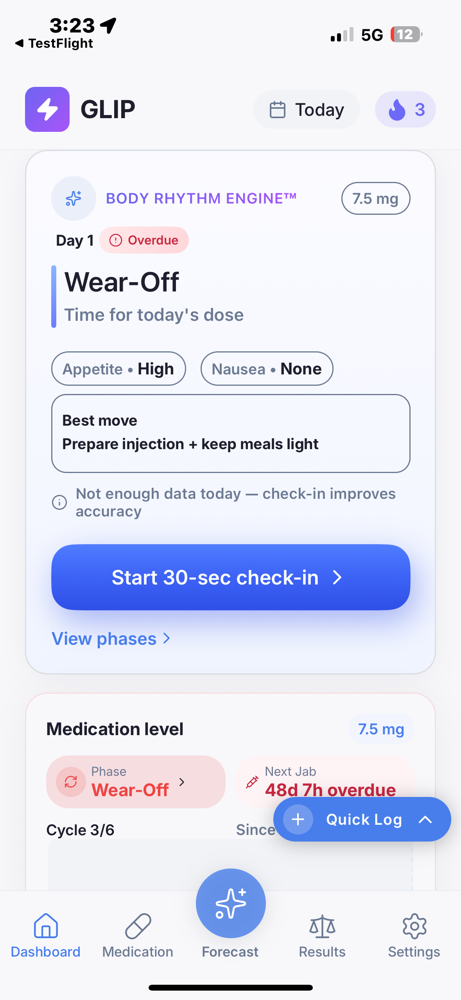
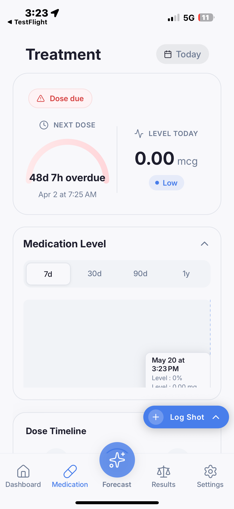
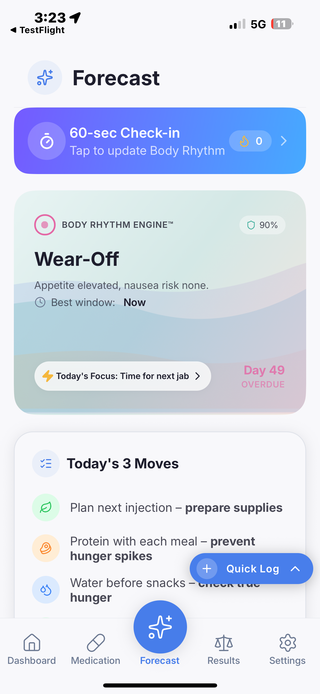
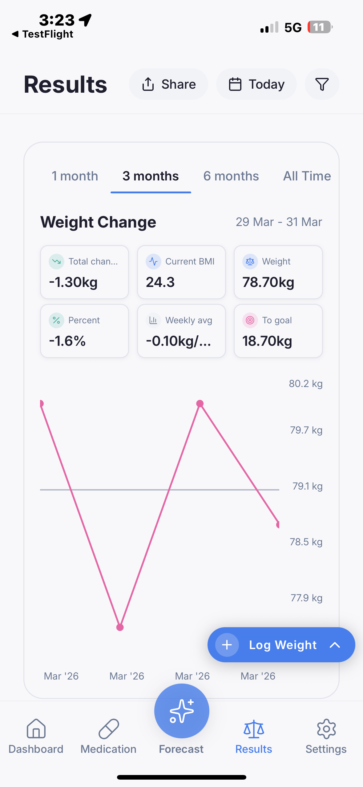
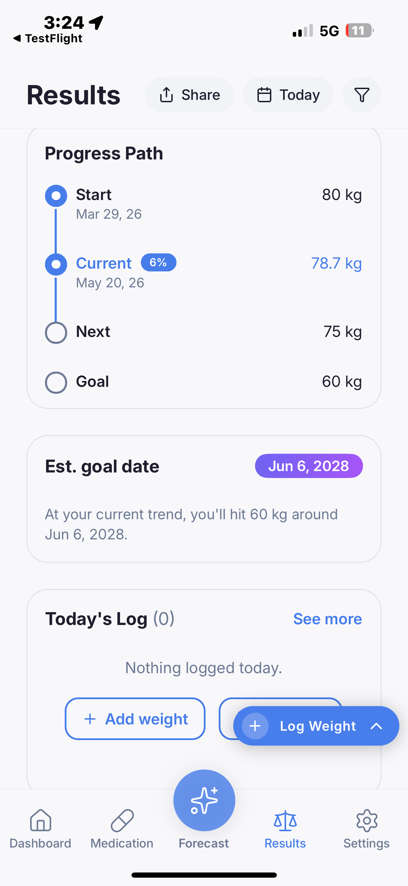
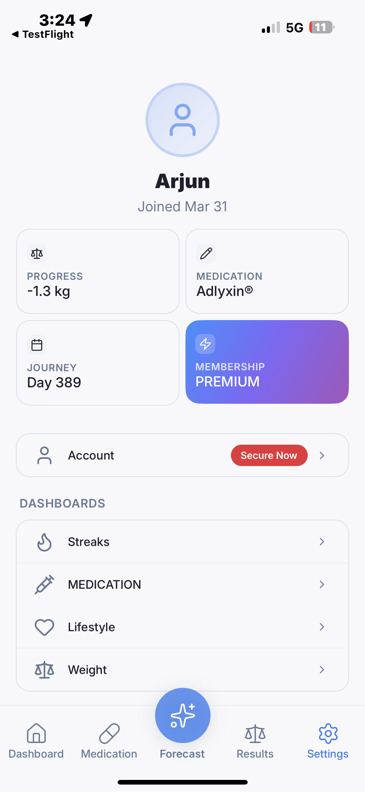
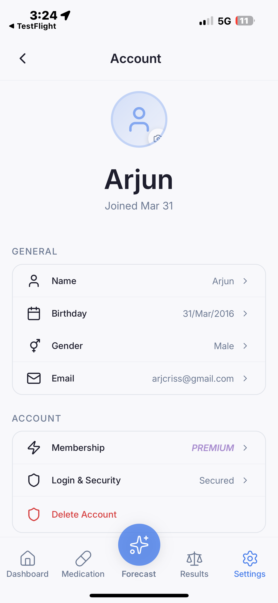
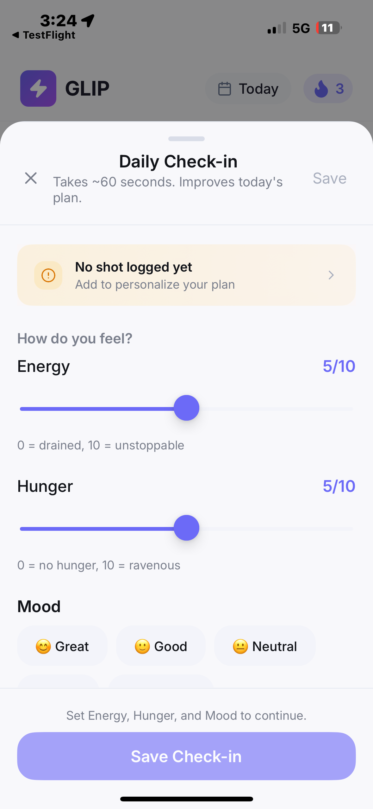

# Glip Mobile App

Glip is a React Native-based mobile application designed for fat and weight loss medication tracking, predictive metabolism forecasting, and treatment adherence. The platform helps individuals on medical weight loss journeys (such as GLP-1 regimens) digitize and streamline their daily treatment plans with real-time tracking, offline-first workflows, and intelligent phase reporting.

Built for users navigating clinical weight loss treatments, Glip enables individuals to track shot schedules, monitor medication wear-off windows, predict hunger spikes, log daily weight milestones, and visualize biometric progress from a single unified platform.

## Screenshots

<table>
  <!-- Row 1: First 4 Screenshots -->
  <tr>
    <td></td>
    <td></td>
    <td></td>
    <td></td>
  </tr>
  <!-- Row 2: Next 4 Screenshots -->
  <tr>
    <td></td>
    <td></td>
    <td></td>
    <td></td>
  </tr>
</table>

## Features

- **Offline-first mobile architecture**
- **GLP-1 Medication tracking (Mounjaro, Adlyxin, Wegovy, etc.)**
- **Proprietary Body Rhythm Engine™ forecasting**
- **Predictive hunger & "wear-off" window alerts**
- **Daily check-ins (Energy, Hunger, Mood)**
- **Weight change & BMI trajectory tracking**
- **Estimated goal date calculator**
- **Shot logging timeline & historical graphs**
- **Custom lifestyle & hydration goals**
- **Multi-cycle tracking (e.g., Cycle 3/6 tracking)**
- **Secure role-based patient authentication**
- **Push notification alerts for upcoming/overdue doses**
- **Real-time analytics & biometric dashboards**
- **Cross-platform support (Android & iOS)**

## Tech Stack

- **React Native**
- **TypeScript**
- **Redux / Context API**
- **React Navigation**
- **REST APIs**
- **Offline data synchronization**
- **Firebase / Push Notifications**
- **Native Android & iOS integrations**

## Project Structure

```text
src/
 ├── api/
 ├── assets/
 ├── components/
 ├── constants/
 ├── contexts/
 ├── hooks/
 ├── navigation/
 ├── screens/
 ├── services/
 ├── store/
 ├── utils/
 └── types/
```

Installation
Clone Repository
Bash
git clone [https://github.com/your-username/glip-mobile-app.git](https://github.com/your-username/glip-mobile-app.git)
cd glip-mobile-app
Install Dependencies
Bash
npm install
